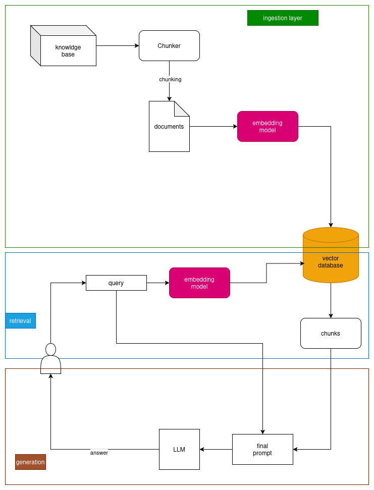

# RAGgae

RAGgae is my first RAG system implementation.

The architecture diagram for the system is given as follows:

### Here's the system overview:
- Ingestion layer:
    - Texts from three PDFs are read and RAW_KNOWLEDGE_BASE is created
    - The texts are then chunked using Recursive Character Text Splitter
    - Chunks produced are stored as FAISS index (vector database)
- Retrieval layer:
    - When the user queries, it's first tokenized and embedded using the same embedder model used in creating vector database
    - Similarity search is performed in order to find the most relevant k-chunks
    - On those retrieved chunks, reranking is performed in order to further improve the quality of retrieval and relevant chunk usage
- Generation layer:
    - Reranked chunks are then passed on to the LLM along with the original question, as a final prompt in order to generate the final answer.

### Tools used in the system are:
1. PDF ingestion & text conversion: **PyPDFLoader**
1. EMBEDDER model: **thenlper/gte-small**
1. Chunking: **Recursive Character Text splitter** from huggingface.
1. Reranker: **cross-encoder/ms-marco-MiniLM-L-6-v2**
1. Reader model (LLM): **HuggingFaceH4/zephyr-7b-beta**

### Evaluation
In order to see how the system performs in general, evaluation & benchmarking is also done. Two specific techniques are used, namely LLM-as-a-judge and RAGAS evaluation framework.
